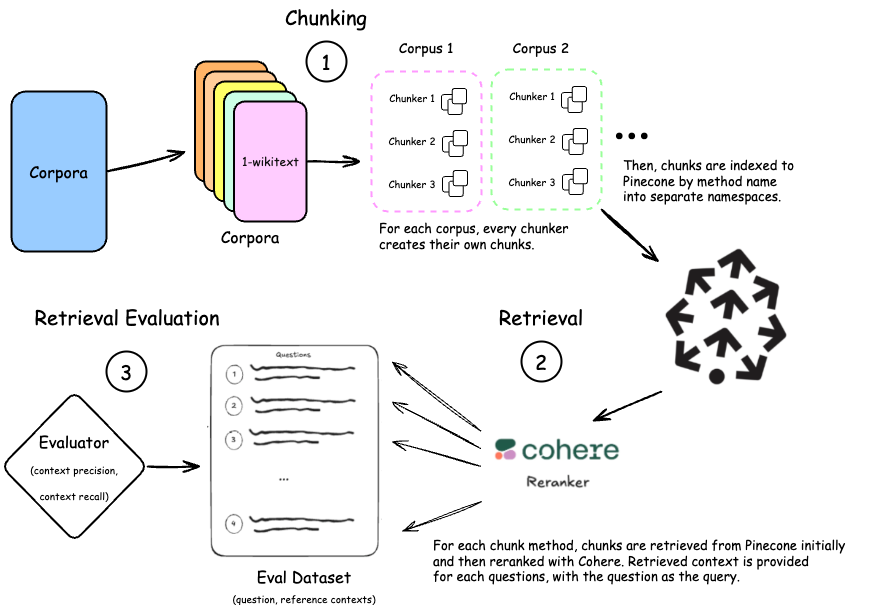

# RAG Text Chunking Benchmark

This benchmark presents an evaluation of chunking (text segmentation) strategies with a RAG pipeline taking into account token-level retrieved contexts, based on the work "[Evaluating Chunking Strategies for Retrieval](https://research.trychroma.com/evaluating-chunking)" by Chroma. We use [`ragas`](https://github.com/explodinggradients/ragas) for evaluation instead of their package.

For each text corpus in the evaluation dataset, we have pairs of question and reference context. Given a question, the task is to compare the difference between the retrieved context and the reference context. We evaluate the performance of different chunking strategies in terms of the quality of the retrieved context; we keep all other parts of the RAG pipeline the same.

Datasets can be found in the [datasets](./datasets/) directory.

- `chroma` is taken directly from the [original report](https://research.trychroma.com/evaluating-chunking#corpora)

- `corpora_public` is data that we gathered from wikitexts and openwebtext. We generated the questions using a similar methodology as outlined in [the report above](https://research.trychroma.com/evaluating-chunking#dataset-generation)

> [!NOTE]
> The latest results and visualizations are live on https://subnet.chunking.com/benchmarks

## Methodology

1. Chunking
   - Each chunker chunked each corpus individually, these chunks were then embedded individually and stored in Pinecone for later use.
   - Each chunker had a different namespace to ensure that different chunks were not mixed up.

> [!NOTE]
> If chunker could not chunk a corpus properly, we exclude that corpus evaluation for the corresponding chunker.

2. Retrieval considering context token limit (done for each question, using a combination of a vector database and reranker):
   - Query the vector database, using the question as the embedding, for the top `rerank_buffer_size=400` chunks for a given question.
   - Pass all `rerank_buffer_size` chunks to a reranker (Cohere reranker v2).
   - At each `token_limit` from `[50, 150, 250]`
     - Aggregate top reranked chunks up to `token_limit` tokens. We used the aggregated text as the retrieved context for the question at that `token_limit`.
     - Thus, we used Cohere's reranker with the same parameters for all chunk methods in this benchmark.

> [!NOTE]
> The cached retrieval results are available in the [`cached_retrieval/`](./cached_retrieval/) directory

3. Retrieval Evaluation (Benchmark):
   - Metrics: We use [`ragas`](https://github.com/explodinggradients/ragas)'s [context precision](https://docs.ragas.io/en/stable/concepts/metrics/available_metrics/context_precision/) and [context recall](https://docs.ragas.io/en/stable/concepts/metrics/available_metrics/context_recall/) configured with `{llm: "gpt-4o-mini", embedding: "text-embedding-3-small}`.
   - For each `token_limit`: we applied metrics on triplets of (question, reference context, and retrieved context above).
   - Repeat for all `token_limit`, we record metrics along with `token_limit` and average chunk size in token `avg_chunk_size` for all chunkers.



## Reproducibility

### Set up

Set up credentials in `.env` file.

```sh
cp .env.example .env
# then fill in the credentials
```

Set up environment with the provided `pyproject.toml` file using [`uv`](https://github.com/astral-sh/uv).

```sh
uv sync
source .venv/bin/activate
```

### Usage

Example run for benchmark on 2025-01-16 `corpora_public` dataset, using Cohere reranker.

```sh
python3 chunking_benchmark/chroma_benchmark.py --run_indexing --run_reranking --to_rerank --run_eval --chunk_dir results/25-01-16-corpora_public/chunks --path_questions datasets/corpora_public/questions.csv --rerank_method "cohere";
```

More options.

```sh
python3 chunking_benchmark/chroma_benchmark.py -h
```
