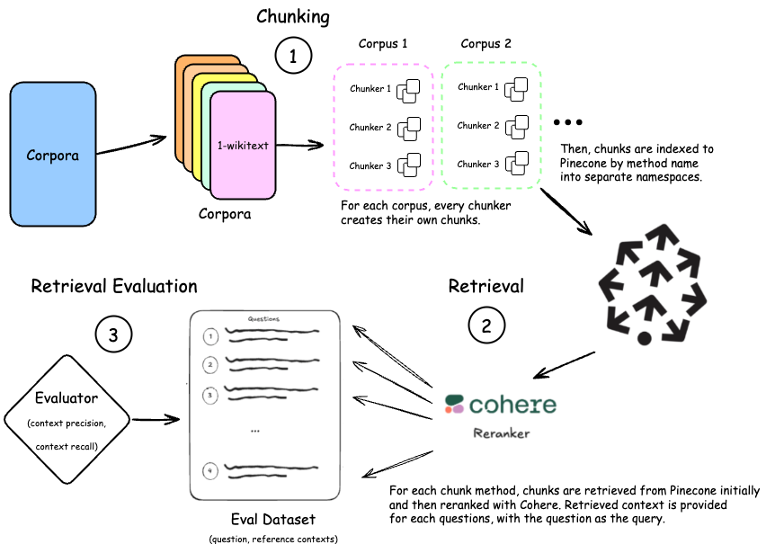
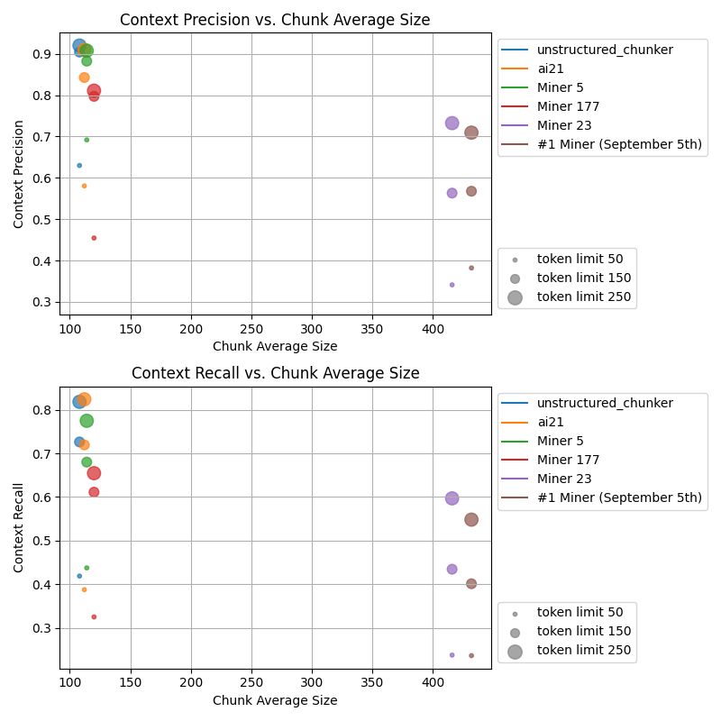
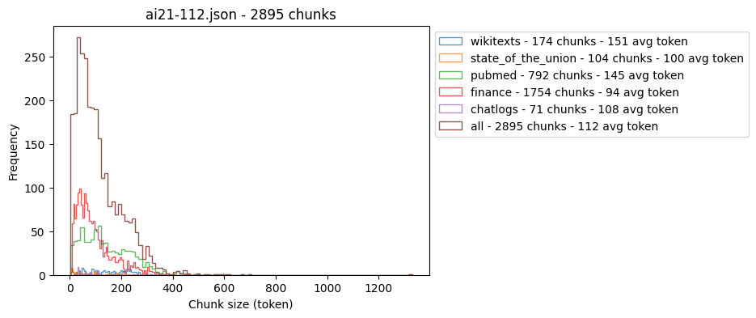
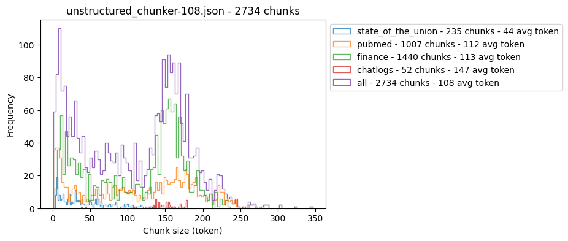
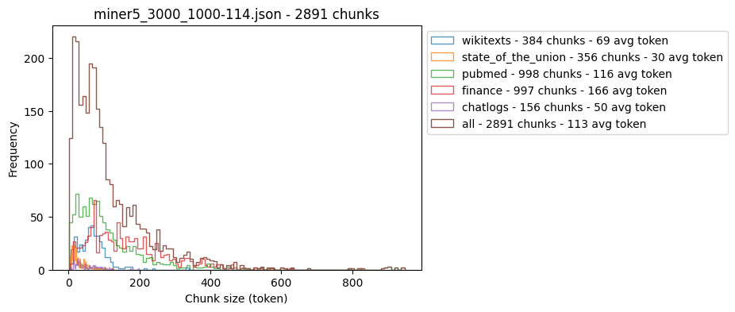
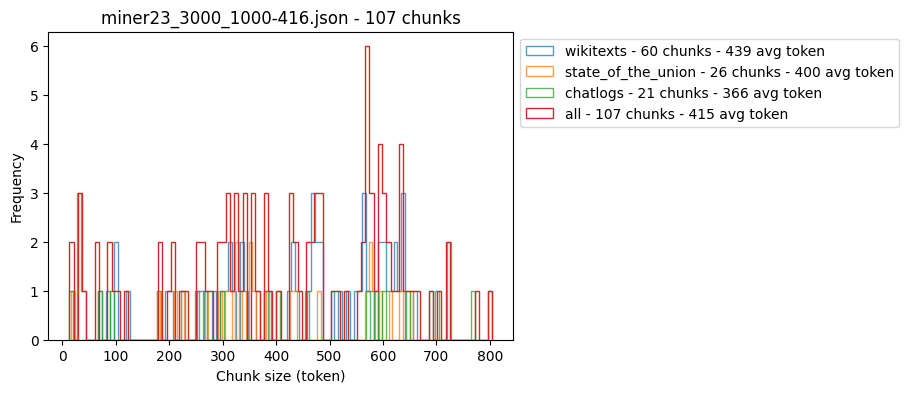
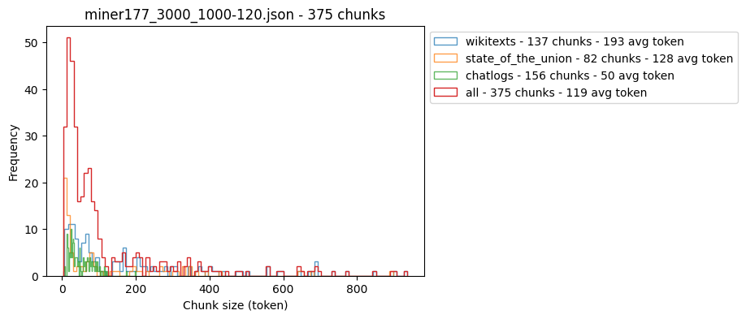

## Introduction

This work presents an evaluation of `Chunking Strategies` with a RAG pipeline taking into account token-level retrieved contexts. We set up the typical RAG for retrieving context from [Chroma Chunking Evaluation Dataset](https://github.com/brandonstarxel/chunking_evaluation/tree/main/chunking_evaluation/evaluation_framework/general_evaluation_data) - a publicly available dataset with selected five corpora mix from both clean and messy text sources (`Wikitext`, `Chatlogs`, `Finance`, `Pubmed`, and `State of the Union Address 2024`).

For each text corpus in the evaluation dataset, we have pairs of question and reference context. Given a question, the task is to compare the difference between the retrieved context and the reference context. We evaluate the performance of different chunking strategies in terms of the quality of the retrieved context.

## Methodology

1. Chunking
   - Chunkers: AI21, Unstructured, and our Subnet variants.
   - Each chunker chunked each corpus individually, these chunks were then embedded individually and stored in Pinecone for later use.
   - Each chunker had a different namespace to ensure that different chunks were not mixed up.

> [!NOTE]
> If chunker could not chunk a corpus properly (For instance, Unstructured always chunks `Wikitexts`fcorpus to a single chunk only and Miner's 23 and 177 could not chunk the longer corpora: `finance` and `pubmed`), we exclude that corpus evaluation for the corresponding chunker.

2. Retrieval considering context token limit (done for each question, using a combination of a vector database and reranker):
   - Query the vector database, using the question as the embedding, for the top `rerank_buffer_size=400` chunks for a given question.
   - Pass all `rerank_buffer_size` chunks to a reranker (Cohere reranker v2).
   - At each `token_limit` from `[50, 150, 250]`
     - Aggregate top reranked chunks up to `token_limit` tokens. We used the aggregated text as the retrieved context for the question at that `token_limit`.
     - Thus, we used Cohere's reranker with the same parameters for all chunk methods in this benchmark.

> [!NOTE]
> The cached retrieval results are available in `cached_retrieval/` directory (raw output of `joblib` cache)

3. Retrieval Evaluation (Benchmark):
   - Metrics: We use RAGAS [context precision](https://docs.ragas.io/en/stable/concepts/metrics/available_metrics/context_precision/) and [context recall](https://docs.ragas.io/en/stable/concepts/metrics/available_metrics/context_recall/) configured with `{llm: "gpt-4o-mini", embedding: "text-embedding-3-small}`.
   - For each `token_limit`: we applied metrics on triplets of (question, reference context, and retrieved context above).
   - Repeat for all `token_limit`, we record metrics along with `token_limit` and average chunk size in token `avg_chunk_size` for all chunkers.



## Experimental Result

### Retrieval Eval Result on the Chroma Chunking Evaluation Dataset

- Each label represents a chunker.
- X-coordinate: Average chunk size (in token) of each chunker variant.
- Y-coordinate: Context recall and Context precision, range in [0, 1].
- Token limits are depicted as data points with size proportional to their values for each chunker.



> [!NOTE]
> The raw results are available at [`assets/chroma/results.json`](assets/chroma/results.json).

### Stats on the chunked dataset

Histograms of the chunked chroma dataset cross corpus for all chunkers.

- AI21 Histogram



- Unstructured Histogram



- Miner 5



- Miner 23



- Miner 177



> [!NOTE]
> The chunks produced can be found at `assets/chroma/chunks/`

## Reproducibility

### Set up

- Set up credentials in `.env` file.

```sh
cp .env.example .env
# then fill in the credentials
```

- Set up environment with the provided `Pipfile`.

```sh
pipenv install
```

### Usage

- Benchmark script to run the whole pipeline.

```sh
LOGLEVEL=WARNING python3 chunking_benchmark/chroma_benchmark.py --run_indexing --run_reranking --run_eval
```

- More options.

```sh
python3 chunking_benchmark/chroma_benchmark.py -h
```
